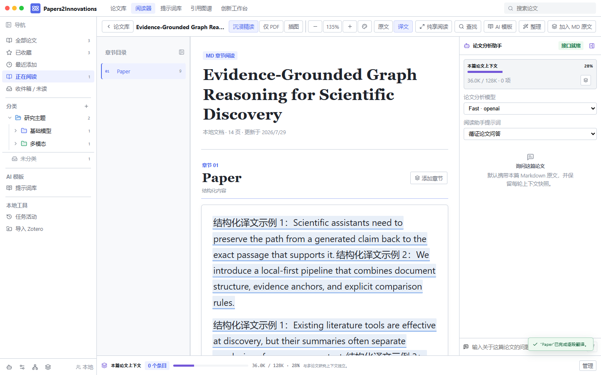
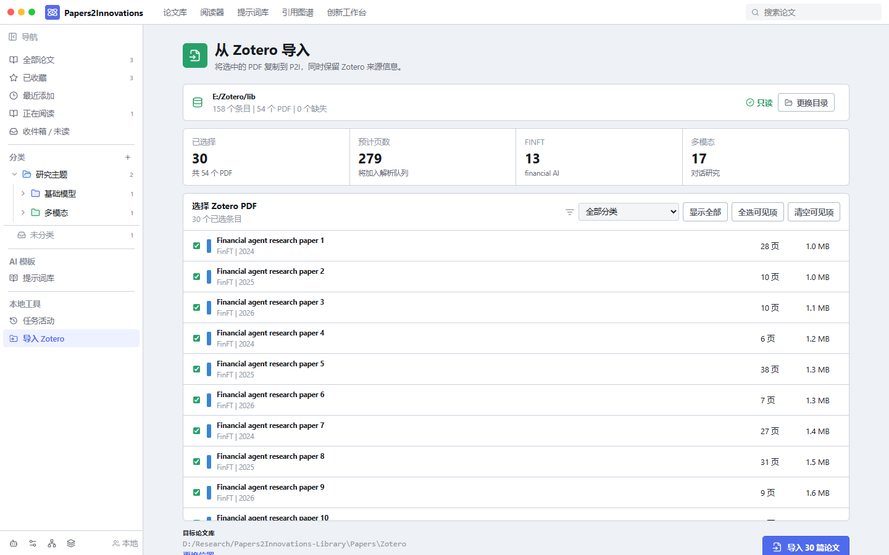
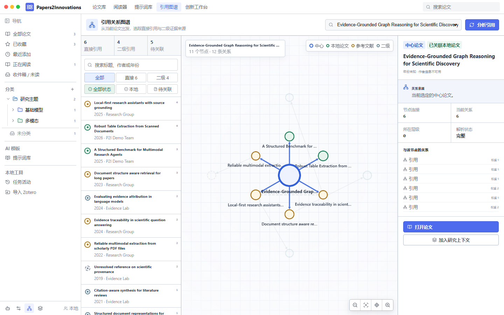

<div align="center">
  
  <h1>Papers2Innovations</h1>
  <p><strong>让中文母语者真正读懂英文论文，并把文献证据变成可验证的研究创新点。</strong></p>
  <p><a href="README.md">中文</a> · <a href="README.en.md">English</a></p>
  <p>
    <a href="https://github.com/cutcutjust/papers2innovations/releases/latest"></a>
    
    
    
  </p>
  <p><a href="https://github.com/cutcutjust/papers2innovations/releases/latest"><strong>下载 Windows 安装包</strong></a></p>
</div>


Papers2Innovations 不是另一个“存 PDF + 一键摘要”工具。它解决两件更实际的事：中文母语者如何跨过英文、术语、公式和长篇结构的阅读门槛；科研新手如何从“看懂一篇”继续走到“比较多篇、发现空白、提出能做实验验证的新问题”。

系统把 PDF 解析为按章节组织、可回到原页核对的结构化文档，再把双语阅读、论文级上下文、图表解读、引用关系和创新分析放进同一个可恢复的本地工作区。

> 当前版本：Windows x64 `v0.1.24`。项目仍处于 `0.1.x` 快速迭代阶段，请保留不可替代源 PDF 的备份。

## 亮点功能

| 你遇到的问题 | Papers2Innovations 的处理方式 | 最终得到什么 |
| --- | --- | --- |
| 英文正文读得慢，术语反复查 | 句子级中文覆盖显示，原始英文和 Markdown 始终不变；固定搭配、专业术语和语境义就近查看。 | 在论文原结构中连续阅读，不丢失证据位置。 |
| PDF 目录、正文、公式、图片混在一起 | Docling 优先解析章节、阅读顺序、页码、表格、图片和公式；失败阶段可恢复。 | 可检索、可定位、可复用的结构化论文。 |
| AI 回答脱离原文，问完就找不到来源 | 每篇论文拥有独立的多轮会话与上下文快照，正文选区、图片和公式追问共用同一会话。 | 问答始终绑定当前论文证据，不污染其他论文。 |
| 看完很多论文，仍不会提炼研究点 | 创新工作台分阶段做证据提取、差异比较、想法生成、创新性检查和实验批判。 | 从文献结论推进到可验证的研究问题与实验草案。 |
| 文献越来越多，分类失控 | 文件树持久化分类，论文和文件夹均可拖动；Zotero 只读导入并保留来源。 | 一个可长期维护的本地研究资料库。 |

## 沉浸精读与双语覆盖

- 阅读器按论文章节组织 Markdown，不按 PDF 页机械切割；PDF 页码和来源锚点仍保留用于核对。
- 正文支持 `80%`～`180%` 缩放、`Ctrl + 鼠标滚轮`、白纸/暖纸/柔绿/深色主题和自定义高对比配色。
- “译文”模式把中文显示在英文原位置，未翻译部分继续保留英文；“原文”模式随时恢复完整英文。
- 点击译文或标记可查看固定搭配、专业术语、直译、论文语境义以及关联问答。
- 翻译、解释和对话只写入独立渲染层，不修改源 Markdown 或 PDF。
- LaTeX 使用 KaTeX 渲染；插图可展开 AI 图解，结果按图片和模型缓存。



纯享模式隐藏全局导航，只保留可调宽的章节目录、正文与论文助手三列，适合连续阅读长论文。


## 从论文库到研究工作区

### 文件树分类

分类不是装饰标签。节点、层级和论文归组都写入本地数据库；父分类自动统计子树。论文可从列表拖到目标文件夹，文件夹也可调整层级。


### Zotero 只读导入

首次打开可一键在“文档”目录创建推荐论文库，也可以选择已有目录。Zotero 会从 profile 自动发现；发现失败时可手动选择包含 `zotero.sqlite` 的数据目录。导入前可筛选 collection、预览页数和文件，PDF 校验 SHA-256 后原子复制，P2I 不修改 Zotero 数据。



### 引用关系图谱

引用图谱以中心论文为核心，稳定展示直接引用和二级证据来源。可以按标题、作者、年份搜索，按层级和本地关联状态筛选；选中节点后只强调相关路径，并在检查器中查看关系、权重和解析状态。



## 论文级上下文与创新工作台

- 每篇论文有唯一、持久化的多轮阅读会话，默认使用该论文 Markdown；超出预算时可生成并复用压缩版本。
- 用户可查看 token 预算与实际文本，增删改自定义上下文，并恢复默认全文。
- 每轮回答保存不可变上下文快照，后续调整不会篡改历史来源。
- 创新工作台使用独立的多论文研究上下文，与单篇阅读上下文完全隔离。
- 提示词库只管理模板，支持新增、编辑、删除和分类，可直接用于阅读、翻译、解释、Markdown 整理和创新流程。


## 模型、密钥与更新


- 接口格式为 **OpenAI-compatible** 或 **Anthropic-compatible**，`Base URL` 始终自定义。
- 上下文预设为 `128K`、`256K`、`1M`，也支持 `4,096`～`2,000,000` 的自定义整数。
- 普通问答、Markdown 整理、全文 OCR 和图片解读可分配不同模型，无需重复保存密钥。
- API Key 加密保存在 Tauri Stronghold；Windows 还保存系统凭据备份，用于模型 ID 或设置迁移后的自动恢复。
- 密钥不会写入 Python、SQLite、日志、前端持久状态、源码或 Git。
- 覆盖安装和应用内更新保留论文库、模型、密钥、提示词、字号、主题、上下文和任务状态。
- 新版本启动时自动弹窗提醒，也可在“安全与应用”中手动检查；签名安装完成后原位重启。

## 快速开始

1. 从 [GitHub Releases](https://github.com/cutcutjust/papers2innovations/releases/latest) 下载最新 Windows x64 安装包。
2. 首次启动选择“使用推荐位置”，或选择一个独立论文库目录。
3. 点击“添加 PDF”，把文件放入 `Papers/`，或关闭 Zotero 后进入“导入 Zotero”。
4. 在“任务活动”查看哈希、版面、OCR、图片、表格和索引阶段；失败后从对应阶段重试。
5. 在“模型与处理”添加自己的接口和密钥，再选择翻译、问答、整理、OCR 或图片解读模型。
6. 进入沉浸精读，按章节阅读、翻译与追问；需要跨论文比较时把证据加入创新工作台。

本地导入与降级解析不要求模型密钥。只有翻译、解释、Markdown 整理、OCR、图片解读、问答和创新流程会调用用户配置的模型。

## 数据边界

```text
Papers2Innovations-Library/
|-- Papers/                 # 本地添加或从 Zotero 复制的 PDF
|-- Exports/
`-- .p2i/
    |-- library.sqlite      # 任务、章节、来源、上下文和运行记录
    |-- generated/          # Markdown、插图、表格和缩略图
    |-- cache/              # OCR 页面、图片分析和引用图谱缓存
    |-- components/
    `-- logs/
```

论文库独立于安装目录。升级或卸载应用不会删除论文库。全文 OCR 默认关闭，只有明确授权后才发送渲染页面，已缓存页面不会重复调用。

## 本地开发

需要 Node.js 20+、Python 3.11、Rust stable（含 `rustfmt`、`clippy`）和 Tauri 2 平台依赖。

```powershell
git clone https://github.com/cutcutjust/papers2innovations.git
cd papers2innovations
npm install
py -3.11 -m venv .venv
.\.venv\Scripts\python.exe -m pip install -e "services/paper-engine[dev]"
.\scripts\build-sidecar.ps1
npm run tauri:dev --workspace @p2i/desktop
```

```powershell
npm run typecheck
npm test
npm run build
.\.venv\Scripts\python.exe -m pytest services/paper-engine/tests
cd apps/desktop/src-tauri
cargo fmt --check
cargo check
cargo clippy -- -D warnings
cargo test
```

仓库不提交 PDF、本地 manifest、论文库、Stronghold、密钥、组件缓存或打包生成物。可复现的问题和聚焦的功能建议请提交到 [GitHub Issues](https://github.com/cutcutjust/papers2innovations/issues)。
