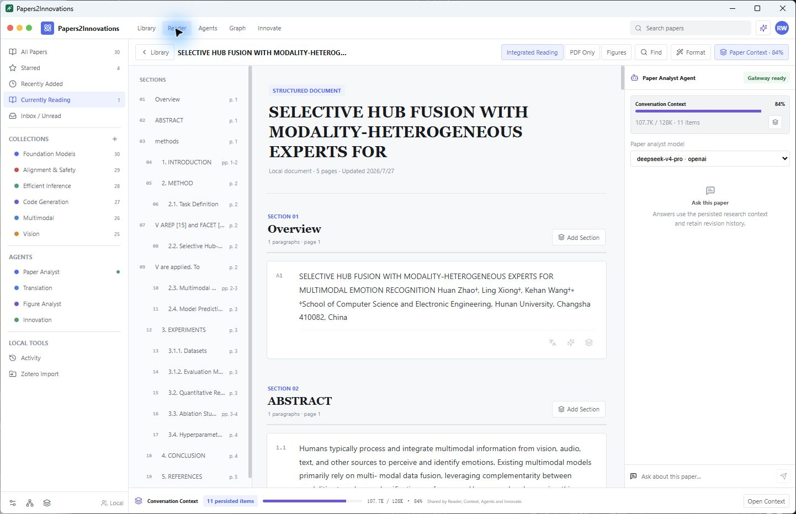
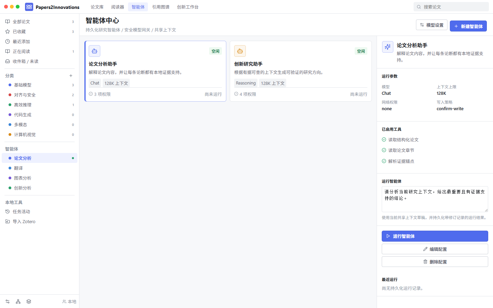
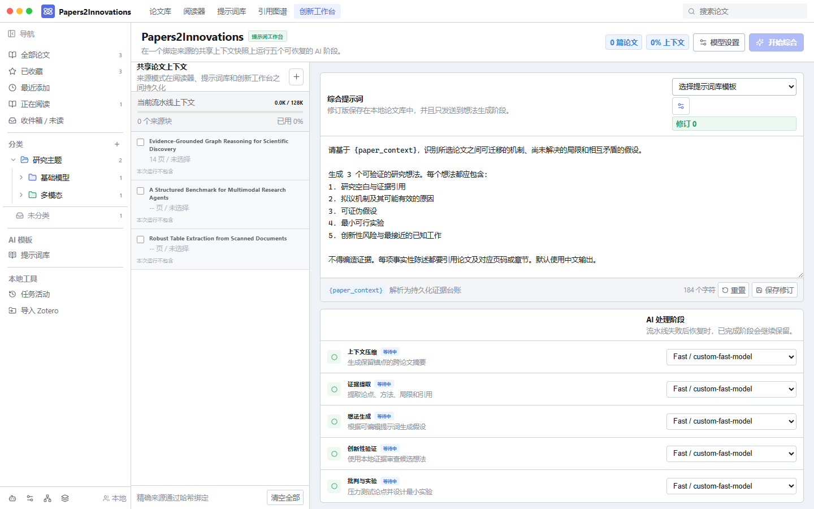
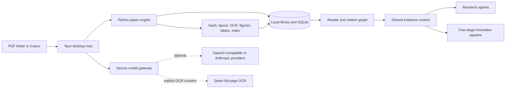

<div align="center">
  
  <h1>Papers2Innovations</h1>
  <p><strong>A local-first research workspace that turns paper collections into structured evidence, reusable context, and testable ideas.</strong></p>
  <p>
    <a href="https://github.com/cutcutjust/papers2innovations/releases/latest"></a>
    
    
    
  </p>
  <p>
    <a href="https://github.com/cutcutjust/papers2innovations/releases/latest"><strong>Download for Windows</strong></a>
    &nbsp;&middot;&nbsp;
    <a href="#quick-start">Quick start</a>
    &nbsp;&middot;&nbsp;
    <a href="#development">Build from source</a>
  </p>
</div>



Papers2Innovations keeps PDFs, generated Markdown, evidence anchors, model usage, and research runs in one persistent workspace. It combines a native desktop shell, a recoverable local parsing engine, secure model access, section-based reading, citation analysis, research agents, and a resumable innovation pipeline.

> **Current release:** `v0.1.11` for Windows x64. The project is in active `0.1.x` development; keep backups of irreplaceable source PDFs.

## What it does

| Area | Capability |
| --- | --- |
| **Ingest** | Watch a local `Papers/` folder, import selected Zotero collections without modifying Zotero, deduplicate by SHA-256, and resume interrupted jobs. |
| **Parse** | Produce structured Markdown, sections, page anchors, figures, tables, and normalized bounding boxes. The compact installer uses a marked `pypdf` fallback; Docling is available in the full development build. |
| **Read** | Navigate by paper section instead of raw PDF pages, render math, open source pages, format extracted Markdown with a chosen model, and keep translations or explanations revisioned. |
| **Context** | Share an evidence-bound context draft across Reader, Agents, and Innovate, with per-model context limits, compression records, and visible token usage. |
| **Analyze** | Build cached two-level citation graphs, preserve unresolved references, inspect provenance, and connect local papers by stable identities. |
| **Automate** | Configure persistent research agents with tool allowlists, network/write policies, checkpoints, usage records, cancellation, and retry. |
| **Innovate** | Run a five-stage pipeline for context compression, evidence extraction, idea generation, novelty verification, and experiment critique. |
| **Maintain** | Install and uninstall normally on Windows, receive signed in-app updates from GitHub Releases, and keep the independent paper library during app upgrades. |

## Research workspaces

### Grounded agents

Agent profiles keep their own model, context limit, system prompt, tool permissions, and run history. Model calls pass through the Rust host; local tools are executed from an explicit allowlist and recorded with provenance.



### From evidence to experiments

The innovation workbench binds every run to an exact context snapshot. Each stage can use a different model, persists its checkpoint and usage, and resumes from the failed stage instead of starting over.



## How it fits together



- **React + TypeScript** renders the desktop workspace and maintains transient UI state.
- **Rust + Tauri 2** owns the native window, file watcher, sidecar lifecycle, updater, Stronghold credentials, path restrictions, and model gateway.
- **Python** handles discovery, hashing, parsing, job recovery, provenance, SQLite migrations, and research runtime persistence.
- **JSON-RPC 2.0 over stdio** keeps the Rust host and Python sidecar contract explicit and testable.

## Quick start

1. Download the latest installer from [GitHub Releases](https://github.com/cutcutjust/papers2innovations/releases/latest) and complete the Windows installation.
2. Open Papers2Innovations and select or create a library directory. The recommended default is `E:\Papers2Innovations-Library`.
3. Add PDFs directly, place them under the library's `Papers/` folder, or use **Zotero Import**. Close Zotero before a formal import so its database is not locked.
4. Follow hashing, layout, OCR, figure, table, and indexing progress in **Activity**. Failed stages can be retried without repeating completed work.
5. Open a paper in **Reader**, add sections to the shared Context, then use Graph, Agents, or Innovate as needed.

AI features are optional. Local ingestion and fallback parsing do not require a model key. Add a provider only when you want translation, explanation, Markdown formatting, agents, or synthesis.

## Data and privacy

The library is independent from the installed application:

```text
Papers2Innovations-Library/
|-- Papers/                 # PDFs managed by the user or copied from Zotero
|-- Exports/
|   |-- bibtex/
|   `-- markdown/
`-- .p2i/
    |-- library.sqlite      # jobs, sections, provenance, context, and runs
    |-- generated/          # Markdown, figures, tables, and thumbnails
    |-- cache/              # OCR pages and citation graph cache
    |-- components/
    `-- logs/
```

- Provider and OCR API keys are encrypted in Tauri Stronghold; the vault key is held by the operating system credential store.
- Keys are not sent to Python, stored in SQLite, written to logs, or persisted in frontend state.
- Remote full-page OCR is disabled until the user explicitly consents. Rendered pages are cached by paper hash, page, model, and prompt version.
- Model requests use the native Rust gateway with timeouts, cancellation, usage accounting, and error redaction.
- Uninstalling the application does not remove the paper library.

## Updates and uninstalling

The native app checks the repository's signed `latest.json` shortly after startup. When a newer version is available, the update banner downloads the signed installer, installs it, and relaunches the app. Updates never block access to the local workspace when GitHub is unavailable.

Use either Windows **Installed apps**, the Start menu uninstall shortcut, or **Models & security > Application > Uninstall Papers2Innovations**. Library data remains in its separate directory.

## Development

### Prerequisites

- Node.js 20 or newer
- Python 3.11
- Rust stable with `rustfmt` and `clippy`
- Tauri 2 platform prerequisites and Microsoft WebView2 on Windows

### Native development setup

```powershell
git clone https://github.com/cutcutjust/papers2innovations.git
cd papers2innovations
npm install
py -3.11 -m venv .venv
.\.venv\Scripts\python.exe -m pip install -e "services/paper-engine[dev]"
.\scripts\build-sidecar.ps1
npm run tauri:dev --workspace @p2i/desktop
```

Build the optional Docling-enabled sidecar when local layout and table models are required:

```powershell
.\.venv\Scripts\python.exe -m pip install -e "services/paper-engine[docling,dev]"
.\scripts\build-sidecar.ps1 -Flavor full
```

The default `core` sidecar deliberately excludes Docling, Torch, Transformers, and related model packages. This keeps the Windows installer and first launch substantially smaller; fallback parse results are labeled `PARTIAL` instead of being presented as full layout extraction.

### Repository layout

```text
apps/desktop/               React UI and Tauri host
packages/contracts/         Shared TypeScript contracts
services/paper-engine/      Python engine, migrations, parsing, and tests
scripts/                    Sidecar build and Windows release automation
docs/images/                Sanitized screenshots from the native app
```

### Validation

```powershell
npm run typecheck
npm test
npm run build
.\.venv\Scripts\python.exe -m pytest services/paper-engine/tests

cd apps/desktop/src-tauri
cargo fmt --check
cargo check
cargo clippy -- -D warnings
cargo test
```

Build a production Windows package after creating the sidecar:

```powershell
.\scripts\build-sidecar.ps1
npm run tauri build --workspace @p2i/desktop
```

Updater signing keys and passwords stay outside the repository. Maintainers can publish the signed NSIS installer, signature, and update manifest with `scripts/publish-windows.ps1`.

## Contributing

Bug reports and focused pull requests are welcome. Before changing a cross-process contract, update the TypeScript contracts, Rust bridge, Python RPC implementation, browser fallback, and relevant tests together. Please avoid committing PDFs, local manifests, model caches, Stronghold files, generated libraries, or credentials.

Use [GitHub Issues](https://github.com/cutcutjust/papers2innovations/issues) for reproducible bugs and feature proposals.
