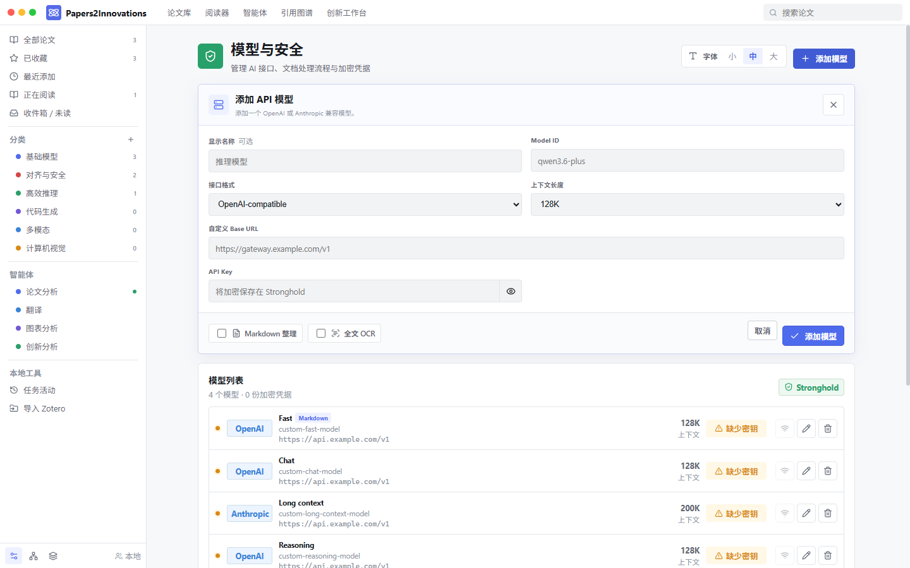
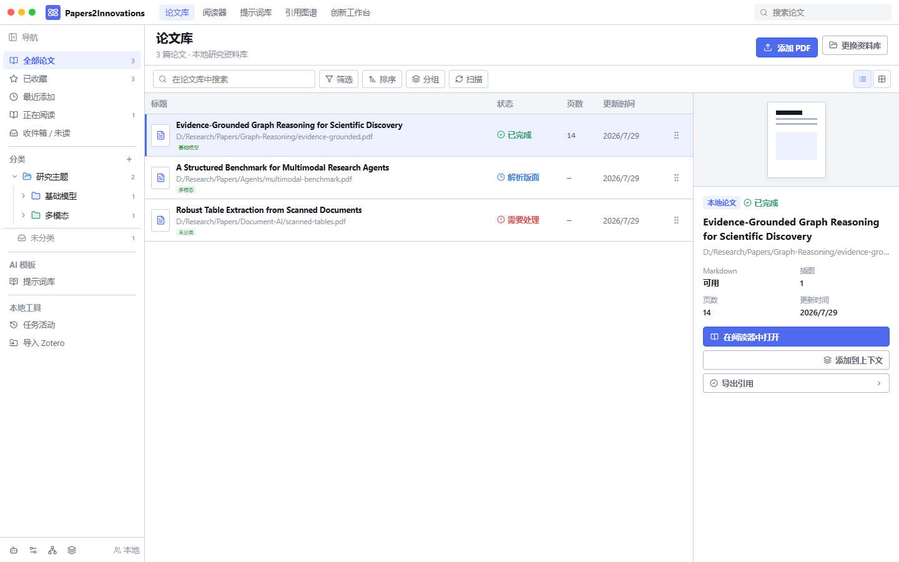
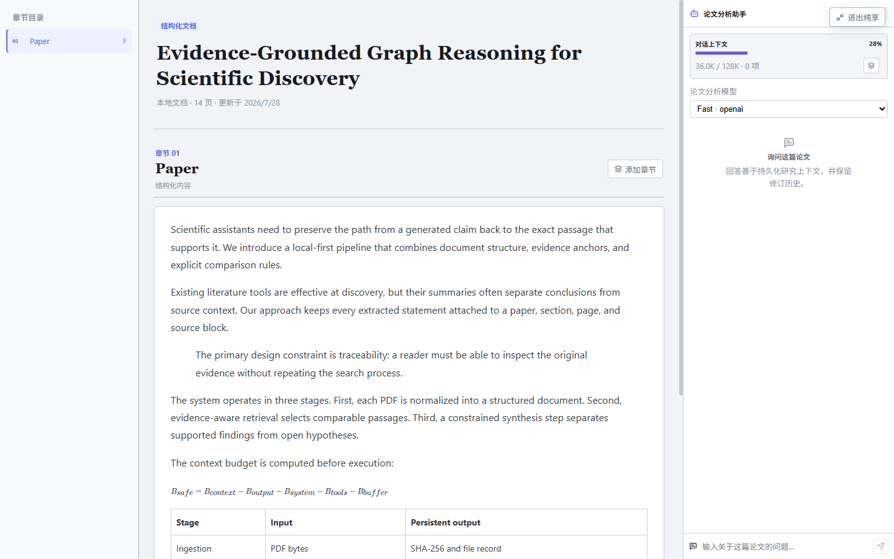

<div align="center">
  
  <h1>Papers2Innovations</h1>
  <p><strong>为中文母语科研者打造：更轻松地读懂英文论文，从文献证据中提炼可验证的创新点。</strong></p>
  <p><a href="README.md">中文</a> · <a href="README.en.md">English</a></p>
  <p>
    <a href="https://github.com/cutcutjust/papers2innovations/releases/latest"></a>
    
    
    
    
  </p>
  <p><a href="https://github.com/cutcutjust/papers2innovations/releases/latest"><strong>下载安装包</strong></a></p>
</div>


Papers2Innovations 面向两类真实困难：中文母语者阅读英文论文时容易被语言、公式和长篇结构阻断；刚进入科研的人即使读完论文，也常常不知道如何比较工作、定位空白并形成研究问题。它把 PDF 解析成按章节组织、可定位回原页的 Markdown，再把翻译、解释、证据上下文和创新分析放到同一个可恢复的本地工作区中。

> 当前源码版本：`v0.1.17`，支持 Windows x64 与 macOS 通用应用（Apple Silicon + Intel）。项目仍处于 `0.1.x` 快速迭代阶段，请保留不可替代源 PDF 的备份。

## 为什么做 Papers2Innovations

很多论文工具停在“保存 PDF”或“生成一段摘要”。但真正困难的是持续的理解与研究判断：英文术语、公式和复杂结构会打断阅读；脱离原文的摘要又很难验证；科研新手还需要从多篇论文的共同假设、方法差异和失败边界中形成新的研究点。

Papers2Innovations 采用一条可检查的研究路径：

| 阶段 | 系统做什么 | 用户得到什么 |
| --- | --- | --- |
| 组织 | 从本地或 Zotero 导入，使用文件树分类，拖动论文即可归组。 | 一个能长期维护的中文论文库，而不是散乱文件夹。 |
| 读懂 | 按论文章节重建 Markdown，关联 PDF 页码、插图、表格与公式。 | 保留论文结构的清晰正文，可随时返回原页核对。 |
| 理解 | 对选中文本翻译、解释公式和方法，默认使用中文回答。 | 不因英语门槛跳过关键论证，也不把 AI 结论当作无来源事实。 |
| 积累 | 将论文、章节或段落加入共享上下文，保存证据锚点与 token 明细。 | 可复用、可追溯的研究材料，而不是一次性聊天记录。 |
| 创新 | 比较证据、提取矛盾与空白，分阶段生成并批判研究想法。 | 从“读过论文”走向“提出可验证的研究问题和实验方案”。 |

系统不会承诺替代研究判断。它强调来源、边界和可复查性，让中文阅读辅助与创新探索建立在同一组论文证据上。

## 核心能力

| 模块 | 能力 |
| --- | --- |
| 论文库 | 监听本地 `Papers/`，只读导入 Zotero，SHA-256 去重；分类以持久化文件树展示，支持子分类、重命名、删除和拖拽归组。 |
| 解析 | 生成章节 Markdown、页码锚点、插图、表格和规范化坐标；中断任务可从失败阶段恢复。 |
| 阅读 | 按章节组织 Markdown 与 PDF 目录；纯享模式全屏保留“目录 / 正文 / 论文助手”三列，并正确渲染 LaTeX 公式。 |
| 上下文 | Reader、Agents 和 Innovate 共享绑定证据的上下文；可展开检查系统提示词、工具 Schema、论文原文及各项 token 预算。 |
| 智能体 | 为每个研究智能体设置模型、提示词、工具权限、网络/写入策略、取消、重试和检查点。 |
| 创新 | 依次执行上下文压缩、证据提取、想法生成、创新性验证与实验批判。 |
| 更新 | 自动提示 GitHub 新版本，也可在设置页手动检查；签名更新完成后自动重启。 |

## 模型、安全与应用



- 接口格式只分为 **OpenAI-compatible** 与 **Anthropic-compatible**，`Base URL` 始终由用户自定义。
- 模型上下文可选 `128K`、`256K`、`1M`，也可输入 `4,096` 到 `2,000,000` 的自定义整数。
- 每个模型可独立用于普通对话、Markdown 整理或全文 OCR；Markdown 整理会保留公式、引用、图片路径和证据锚点。
- API Key 加密保存在 Tauri Stronghold，保险库密码由系统钥匙串保护；Python、SQLite 和日志均无法读取密钥。
- 自定义模型、上下文限制、任务模型、OCR 授权、字号和论文库路径会同时保存在 WebView 设置与 Stronghold 非敏感快照中。
- **覆盖安装与应用内更新不会清空已有设置或密钥。** 只有用户明确删除模型/密钥时才会移除对应凭据。
- 设置分为“模型与处理”和“安全与应用”两个页面，模型工作流与更新、字体、隐私、卸载互不混杂。
- 上下文页的“回答输出预留”是为模型生成回答保留的容量，不是发送给模型的输入文本；预算和当前文本估算会分别显示。

## 研究工作区

### 文件树分类

分类不是装饰性标签。所有节点和论文归组关系都写入本地数据库；父分类自动统计整个子树，点击节点即可筛选，论文从列表拖到目标文件夹即可移动。Zotero collection 首次升级时会自动迁移到 `Zotero` 树中。



### 纯享阅读

纯享模式隐藏应用导航、全局侧栏、工具栏和底部状态条，只留下章节目录、结构化 Markdown 正文和论文阅读助手。它适合连续阅读长论文；目录仍可调宽，助手仍使用持久化证据上下文，按 `Esc` 即可退出。



### 智能体中心

智能体只使用显式允许的本地工具。系统提示词默认要求中文输出，并要求事实性结论引用论文、章节、文本块或页码锚点。


### 从证据到实验

创新工作台把每次运行绑定到确定的上下文快照。各阶段可选择不同模型，已完成检查点会保留，失败后从中断阶段继续。


## 快速开始

1. 从 [GitHub Releases](https://github.com/cutcutjust/papers2innovations/releases/latest) 下载对应平台的最新安装包；macOS 使用通用 `.dmg`。
2. 打开应用并选择独立论文库目录，如 `~/Documents/Papers2Innovations-Library`。
3. 将 PDF 放入 `Papers/`，或关闭 Zotero 后使用“导入 Zotero”。
4. 在“任务活动”查看哈希、版面、OCR、图像、表格和索引进度；失败阶段可重试。
5. 在侧栏新建分类或子分类，把论文拖入相应文件夹，建立自己的研究主题树。
6. 在“模型与处理”中添加模型、自定义 Base URL、上下文长度和 API Key，再分配 Markdown/OCR 模型。
7. 在阅读器中按章节阅读；需要专注时进入纯享模式，将关键证据加入共享上下文，再使用智能体或创新工作台提炼研究点。

本地导入与降级解析无需模型密钥。翻译、解释、Markdown 整理、OCR、智能体和综合功能才会调用用户配置的模型。

## 数据边界

```text
Papers2Innovations-Library/
|-- Papers/                 # 用户管理或从 Zotero 复制的 PDF
|-- Exports/
`-- .p2i/
    |-- library.sqlite      # 任务、章节、来源、上下文和运行记录
    |-- generated/          # Markdown、插图、表格和缩略图
    |-- cache/              # OCR 页面和引用图谱缓存
    |-- components/
    `-- logs/
```

论文库独立于应用安装目录。升级或卸载 Papers2Innovations 不会删除论文库。全文 OCR 默认关闭，只有用户明确授权后才会发送渲染页面，且已缓存页面不会重复计费调用。

## 更新与卸载

应用启动后会检查签名的 GitHub `latest.json`。发现新版本时可直接下载、安装并重启；也可在“安全与应用”页面点击“检查新版本”。GitHub 暂时不可用时不会阻止本地功能。

Windows 可通过“已安装的应用”、开始菜单卸载快捷方式或应用设置卸载；macOS 可将应用从“应用程序”移到废纸篓。两种方式都只移除应用本体，保留独立的论文库与用户数据。

## 本地开发

需要 Node.js 20+、Python 3.11、Rust stable（含 `rustfmt`、`clippy`）以及对应平台的 Tauri 2 构建依赖。

在 Apple Silicon Mac 上安装 Xcode Command Line Tools、Rust 与 Rosetta 2 后，可直接生成同时支持 Apple Silicon 和 Intel 的 `.app` 与 `.dmg`。脚本会下载并校验官方 universal Python，不修改系统 Python。

```bash
git clone https://github.com/cutcutjust/papers2innovations.git
cd papers2innovations
npm run macos:build
```

产物位于 `apps/desktop/src-tauri/target/universal-apple-darwin/release/bundle/`。

Windows 开发环境：

```powershell
git clone https://github.com/cutcutjust/papers2innovations.git
cd papers2innovations
npm install
py -3.11 -m venv .venv
.\.venv\Scripts\python.exe -m pip install -e "services/paper-engine[dev]"
.\scripts\build-sidecar.ps1
npm run tauri:dev --workspace @p2i/desktop
```

质量门：

```powershell
npm run typecheck
npm test
npm run build
.\.venv\Scripts\python.exe -m pytest services/paper-engine/tests
cd apps/desktop/src-tauri
cargo fmt --check
cargo check
cargo clippy -- -D warnings
cargo test
```

仓库不会提交 PDF、本地 manifest、论文库、Stronghold 文件、密钥、组件缓存或打包生成物。问题和功能建议请提交到 [GitHub Issues](https://github.com/cutcutjust/papers2innovations/issues)。
